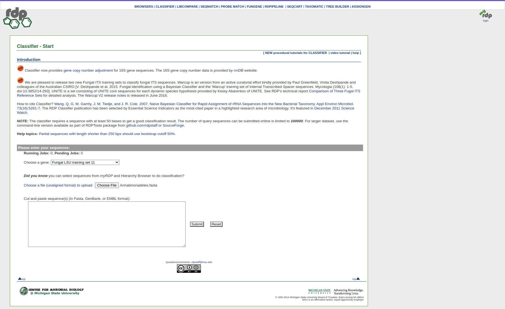
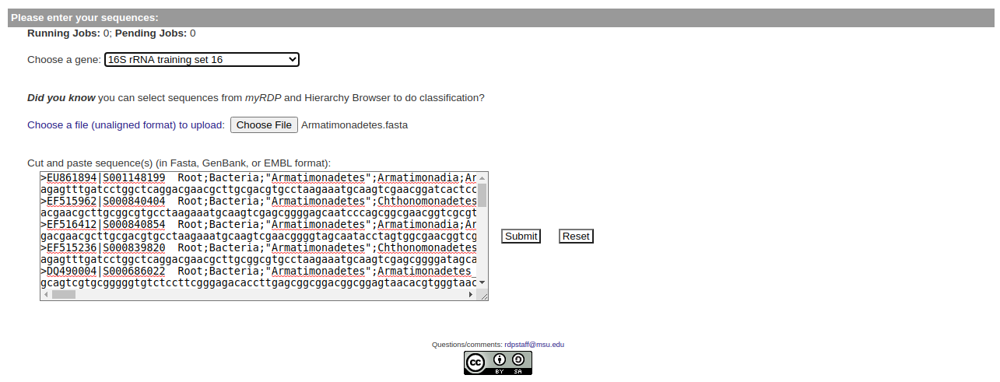
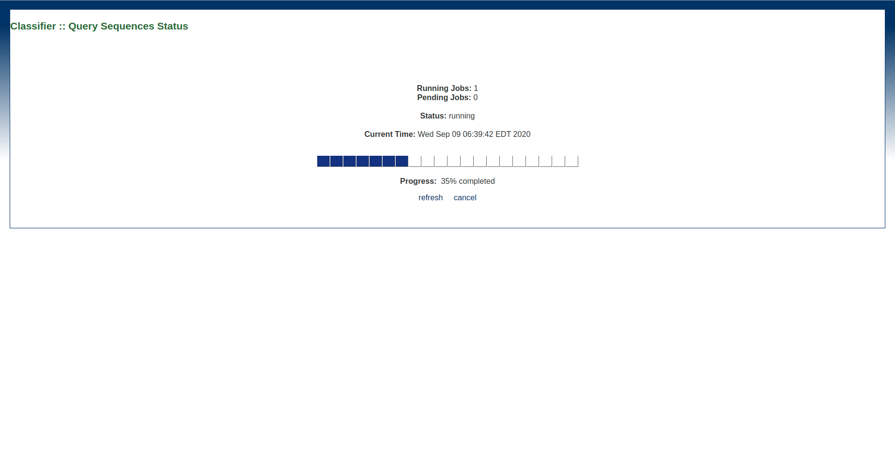
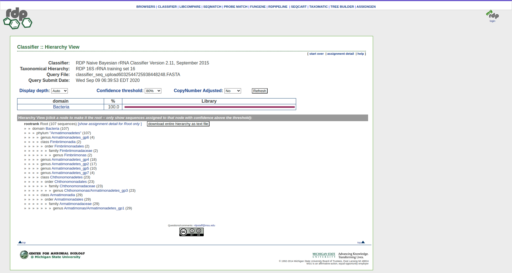

# Lembar Kerja Praktikum 2

---
Nama : Muhamad Hilmy Haidar
NIM : G64170030

---

## RDP Classifier

RDP (Ribosomal Database Project) adalah sebuah alat untuk melakukan klasifikasi taksonomi terhadap sekuen data rRNA dengan metode Klasifikasi Bayes. RDP Classifier dapat mengelompokkan suatu domain ke dalam genus dengan tingkat keyakinan yang bervariasi bergantung pada data dan hasil Klasifikasi Bayes.

### Konsep

Metode Klasifikasi yang digunakan adalah Naive Bayes. Naive Bayes memanfaatkan peluang kemunculan suatu kejadian berdasarkan peluang kejadian sebelumnya yang telah muncul.

<!-- $$
P(C_k|x) = \frac{P(C_k)P(x|C_k)}{P(x)}
$$ --> 

Pada kasus pengklasifikasian rRNA, sekuen huruf yang merepresentasikan asam amino akan dihitung peluang kemunculannya. Tiap sekuen akan di *assign* ke dalam suatu genus. Dari setiap genus yang muncul, dicari nilai *confidence* nya. Semua nilai tersebut akan dibentuk menjadi sebuah pohon hirarkis (*Hierarchy Tree*). Setelah pohon hirarkis terbentuk, dicari nilai peluang posterior yang terbesar. Genus yang memiliki nilai posterior yang besar akan diambil sebagai hasil akhir.

> Program lengkapnya dapat diakses di sini [https://github.com/rdpstaff/classifier/blob/master/src/edu/msu/cme/rdp/classifier/Classifier.java](https://github.com/rdpstaff/classifier/blob/master/src/edu/msu/cme/rdp/classifier/Classifier.java)

### Penggunaan

Pada alamat website [`http://rdp.cme.msu.edu/classifier/classifier.jsp`](http://rdp.cme.msu.edu/classifier/classifier.jsp) kita dapat menggunakan secara langsung RDP Classifier untuk melihat klasifikasi dari suatu sekuen gen. Berikut cara penggunaannya : 
1. ##### Pergi ke Website
    Pergi ke halaman website, terlebih dahulu dan pastikan tampilannya seperti gambar berikut:
    
    &nbsp;
    
    

    </img>
    

    
    &nbsp;

2. ##### File Sampel
    Langkah pertama pilih file sampel pada halaman berikut : 
    
    [https://github.com/rdpstaff/classifier/tree/master/samplefiles](https://github.com/rdpstaff/classifier/tree/master/samplefiles)

3. ##### Training Set
    Setelah memilih file sampel misalnya `Armatimonadetes.fasta`, Paste isi file ke dalam kotak yang di sediakan seperti gambar di bawah ini :
    
    &nbsp;

    

    </img>
    

    >  Kita juga bisa memilih training set yang dijadikan sebagai acuan untuk klasifikasi dan menggunakan file format selain fasta (yaitu GenBank atau EMBL).

4. ##### Klasifikasi
    Tekan submit dan tunggu sampai proses dijalankan oleh server selesai. Server akan melakukan klasifikasi terhadap data yang kita berikan berdasarkan traning set nya. Proses menunggu akan terlihat seperti ini :
    
    &nbsp;

    

    </img>
    

    &nbsp;

    Setelah itu, kita akan memperoleh hasil klasifikasinya seperti gambar di bawah ini :

    &nbsp;

    

    </img>
    

    &nbsp;

### Pemanfaatan

RDP Classifier sangat berguna untuk mengklasifikasikan suatu sekuen-sekuen RNA ke dalam domain dan genus nya. Alat ini bisa melakukan klasifikasi dengan cepat terhadap beberapa jenis format data dan penggunaannya sangatlah mudah. Oleh karena itu alat ini bisa dijadikan sebagai alat bantu saat kita memiliki banyak data dan ingin mengklasifikasikannya secara cepat dan mudah. 

### Referensi
- [https://github.com/rdpstaff/classifier](https://github.com/rdpstaff/classifier)
- [http://rdp.cme.msu.edu/classifier/classifier.jsp](http://rdp.cme.msu.edu/classifier/classifier.jsp)
- [http://rdp.cme.msu.edu/tutorials/classifier/classifer_cover_page.html](http://rdp.cme.msu.edu/tutorials/classifier/classifer_cover_page.html)